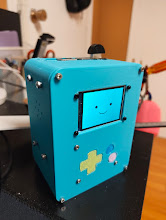

# BMO AI Assistant

<p align="center">
  
</p>

A Raspberry Pi robot built on a small publish/subscribe component framework.
Independent components (camera, screen "face", microphone, speaker, buttons,
motors, a Gemini Live voice bridge, and a web dashboard) each run as their own
process and communicate over named channels through a central router.

## Architecture

Every capability is a **component** — a Python module under [components/](components/)
that subscribes to and/or publishes on channels (e.g. `/s/microphone/audio`,
`/s/speaker/audio`, `/s/camera/frame`, `/s/screen/display`, `/c/motor/drive`).
Components, their channel permissions, and their `groups` are declared in
[config.yaml](config.yaml) and wired together at runtime by
[**botOS**](https://github.com/David-Feldt/botOS) — my own robot runtime that
handles the TCP transport, the pub/sub channel router connecting components, and
the process launcher (`bot run`).

```
mic ─▶ /s/microphone/audio ─▶ gemini_live ─▶ /s/speaker/audio ─▶ speaker
                         └──▶ audio_visualizer / dashboard
camera ─▶ /s/camera/frame ─▶ stream_display / dashboard
buttons ─▶ /s/buttons/event ─▶ button_reader / dashboard
keyboard ─▶ /c/motor/drive ─▶ motor_driver
```

The headline feature is **`gemini_live`**: it streams 16 kHz mic audio to a
Gemini Live session and plays back Gemini's 24 kHz audio replies, with session
resumption + sliding-window context compression and a reconnect loop so
conversations survive Google's periodic WebSocket resets and the 10-minute
connection cap.

## Requirements

- Raspberry Pi (tested with Python 3.13) with the audio/GPIO hardware wired up
  (USB microphone, MAX98357A / HiFiBerry speaker amp, SPI display, button matrix,
  camera, motor driver — components can be enabled/disabled in `config.yaml`).
- [**botOS**](https://github.com/David-Feldt/botOS) — my robot runtime framework
  that provides the TCP transport, the pub/sub channel router that connects the
  components, and the `bot` Python module / `bot run` launcher. It lives in the
  (gitignored) `.bot/` and `.botos/` directories on the Pi and is **not** a PyPI
  package — a fresh clone needs botOS installed separately before the components
  will run.
- A Google AI Studio API key for the Gemini features.

## Setup

```bash
# 1. Create / activate a virtualenv (or use the bot framework's venv)
python3 -m venv .venv && source .venv/bin/activate

# 2. Install Python dependencies
pip install -r requirements.txt

# 3. On the Pi, install the system GPIO/camera packages
sudo apt install python3-gpiozero python3-picamera2

# 4. Configure your API key
cp .env.example .env
# then edit .env and set GEMINI_API_KEY=<your-google-ai-studio-key>
```

## Running

Components are launched by the framework according to [config.yaml](config.yaml):

```bash
bot run
```

Components are tagged with `groups` (e.g. `dashboard`, `gemini`, `audio`,
`camera`, `drive`, `buttons`, `loopback`) so you can bring up just the subset you
need. With the `dashboard` group running, [components/main.py](components/main.py)
serves a web dashboard on port **8000** with live camera, screen, audio levels,
motor state, and button status.

## Tests / hardware checks

The scripts in [tests/](tests/) are standalone diagnostics that bypass the `bot`
framework — useful for isolating hardware or API issues. They auto-load
`GEMINI_API_KEY` from `.env`:

| Script | Purpose |
| --- | --- |
| [tests/test_gemini_basic.py](tests/test_gemini_basic.py) | Minimal Gemini text in / text out |
| [tests/test_gemini_text.py](tests/test_gemini_text.py) | Text → Gemini Live → audio playback |
| [tests/test_gemini_live.py](tests/test_gemini_live.py) | Full mic ↔ Gemini Live ↔ speaker loop |
| [tests/test_mic.py](tests/test_mic.py) | Record mic, transcribe via Gemini |
| [tests/test_mic_vosk.py](tests/test_mic_vosk.py) | Record and transcribe locally with Vosk |
| [tests/test_tts.py](tests/test_tts.py) | Gemini TTS straight to the speaker (`aplay`) |
| [tests/test_loopback.py](tests/test_loopback.py) | Raw `arecord` → `aplay` mic-to-speaker loopback |

Run one directly, e.g.:

```bash
python tests/test_gemini_basic.py
```

## Repo layout

```
components/      # pub/sub components (the robot's capabilities)
tests/           # standalone hardware / API diagnostics
config.yaml      # component registry: files, groups, channel permissions
.env.example     # template — copy to .env and add your key
requirements.txt # Python dependencies
```

## Configuration & secrets

`.env` is gitignored and never committed — only [.env.example](.env.example) is
tracked. Set `GEMINI_API_KEY` there.
